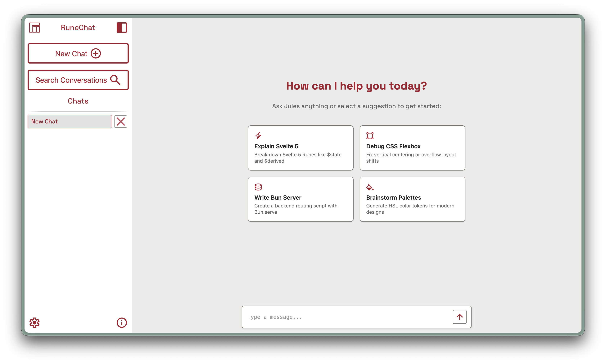
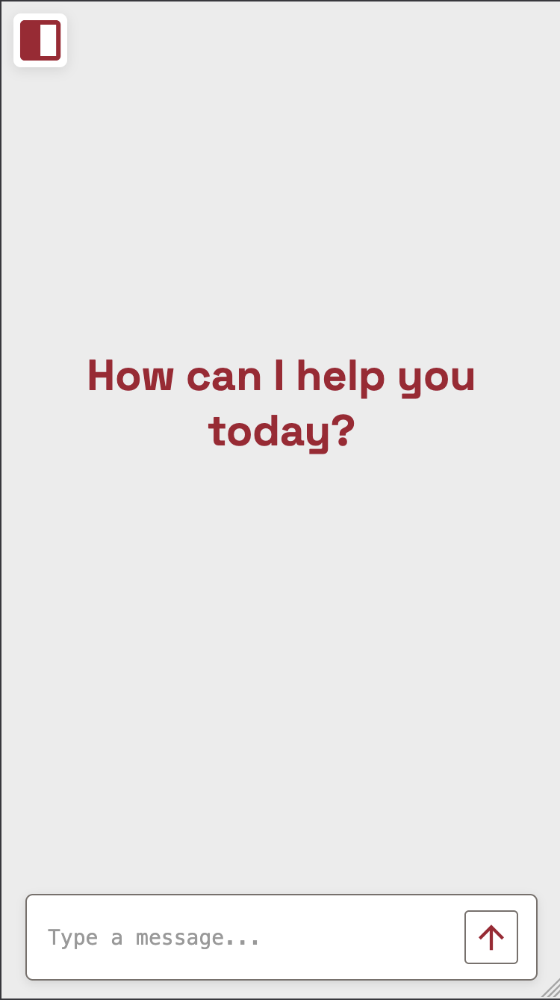

# RuneChat

[](https://github.com/Papaya-Voldemort/RuneChat/commits/main)
[](https://github.com/Papaya-Voldemort/RuneChat/actions/workflows/verify.yml)
[](https://github.com/Papaya-Voldemort/RuneChat/actions/workflows/release.yml)

A custom quiky AI chatbot interface for Hack Club AI!

Live Demo: [https://runechat.elinelson.dev](https://runechat.elinelson.dev)

> AI Declaration: This project used AI for the following: Specific help on storage. See more in [`ai-declaration.md`](./ai-declaration.md).

> RuneChat is powered by [HCAI](https://ai.hackclub.com/). If Hackclub AI is down your API key will not work

## Screenshots

### Desktop Interface


### Mobile Interface


## What?

RuneChat is one of my favorite projects I have ever worked on. It was the first I ever touched a JS framework or really used TS to its fullest.

I have always wanted to make a simple ChatBot UI and thought this was the perfect opportunity to make one!

So boom! RuneChat was born! A fun fact about the project is that its original name was RuneGPT, a combination of Runes from Svelte 5 and ChatGPT, but it was later renamed for brand consistency.

## Features

- Custom Material Icons
- BYOK Support
- Front and Backend
- Reasoning Model Support
- Model Personas

## Quick Start

Go to our web URL to try it out now: [Click Here](https://runechat-production-16f4.up.railway.app/)

Or for a deeper look:

```bash
git clone https://github.com/Papaya-Voldemort/RuneChat.git
cd RuneChat
bun install
bun run dev
```

For image input in a deployed environment, set `PUBLIC_BASE_URL` to RuneChat's
public HTTPS URL. RuneChat serves each image at a temporary opaque URL so the
model provider can fetch it without a base64-encoded chat payload.

## Railway deployment

Deploy the repository root, not `src/`: the root contains `package.json`,
`server.ts`, and the Railway configuration. `railway.json` explicitly builds
the Vite client with `bun run build` and starts the Bun server with
`bun run start`, so Railway serves both the web app and its `/api` endpoints.
Set Railway's **Root Directory** to the repository root (leave it blank for a
single-repository service) and set `PUBLIC_BASE_URL` to the generated Railway
domain when using image attachments.

## Desktop app (Tauri v2)

RuneChat can be packaged for macOS, Windows, and Linux with Tauri v2. The
desktop bundle includes the Bun API server as a platform-specific sidecar, so
chat and text-attachment requests continue to use a local API at
`127.0.0.1:3000`.

```bash
bun run tauri:dev
bun run tauri:build
```

Build each operating system on a matching CI runner (or a machine with that
platform's Tauri prerequisites). The sidecar preparation script maps Apple
Silicon/Intel macOS, ARM64/x64 Linux, and ARM64/x64 Windows to Tauri's target
triples automatically. Generated sidecars stay out of Git.

`VITE_API_BASE_URL` overrides the API address. Set it to a public HTTPS API for
mobile builds or when using image attachments: an AI provider cannot retrieve
an image hosted on a desktop user's loopback address. The bundled Bun sidecar
is desktop-only.

The primary app icon is `src-tauri/icons/RuneChat.png`. Its light, dark, clear,
and tinted source variants are retained in `src-tauri/icons/runechat-variants/`
for future native asset-catalog or mobile packaging work.

On desktop, RuneChat swaps between the light and dark icon automatically when
the in-app theme changes. The desktop icon PNGs include transparent padding so
they sit correctly in the Dock. iOS uses Apple’s opaque AppIcon catalog; its
light/dark/clear/tinted variants are managed in Xcode’s asset editor.

Android launcher assets use adaptive foreground and background layers, legacy
and round fallbacks, and an Android 13+ monochrome layer for themed icons. The
source layers live in `src-tauri/icons/android-source/`.

### Installing an unsigned macOS build

The macOS artifact published by this repository is ad-hoc signed, but it is
not signed with an Apple Developer identity or notarized. After opening the
downloaded DMG, drag RuneChat to `Applications`. Then Control-click (or
right-click) `RuneChat.app`, choose **Open**, and confirm **Open** in the
warning dialog. macOS remembers that choice, so subsequent launches work
normally.

If macOS blocks the first launch, open **System Settings → Privacy & Security**
and select **Open Anyway** for RuneChat, then confirm. Only when you trust the
downloaded release, this Terminal command removes the download quarantine:

```bash
xattr -dr com.apple.quarantine /Applications/RuneChat.app
```

Unsigned builds can display a Gatekeeper warning; that is expected. Do not run
the command for an app obtained from an untrusted source.

## GitHub releases

Pushing a version tag such as `v0.1.0` starts the release workflow. It creates
a draft GitHub release containing macOS (Apple Silicon and Intel) DMGs, a
Windows x64 installer, and Android APK/AAB artifacts. Review the draft and
publish it from GitHub when ready.

The Android release job requires these repository secrets:

- `ANDROID_KEY_BASE64` — base64-encoded upload keystore (`base64 -i upload-keystore.jks` on macOS)
- `ANDROID_KEY_ALIAS` — the key alias
- `ANDROID_KEY_PASSWORD` — the keystore/key password

Those values are written only on the GitHub runner to the ignored
`src-tauri/gen/android/keystore.properties` file. Keep the keystore and its
password out of Git. Android artifacts are signed with this key and can be
uploaded to Google Play; the first Play upload still needs to be completed in
the Play Console.

## Future Updates

In the future I want to add the following new features:

- Multi Media Inputs
- Image/Video generation

## Final Notes

Thanks for checking out RuneChat hope you had fun :)
